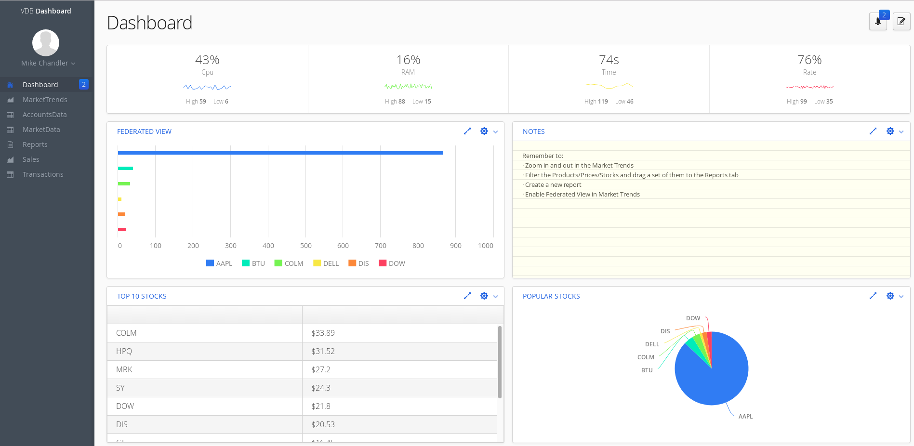

=  What's this

This is a sample project for demonstrating Teiid Data Service on OpenShift. This example originally came from vaadin https://github.com/vaadin/dashboard-demo[vaadin demo].

The current dashboard mainly consume the OData Service supplied by https://github.com/teiid/wildfly-swarm-teiid-examples/tree/master/vdb-datafederation[Teiid WFS vdb-datafederation Eexample], the following api be invoked:

[source, text]
----
http://${HOSTS}/odata4/Portfolio.1/APAC_Customers/account?$format=JSON
http://${HOSTS}/odata4/Portfolio.1/APAC_Customers_VBL/account?$format=JSON
http://${HOSTS}/odata4/Portfolio.1/US_Customers/account?$format=JSON
http://${HOSTS}/odata4/Portfolio.1/US_Customers/marketdata?$format=JSON
http://${HOSTS}/odata4/Portfolio.1/US_Customers_VBL/account?$format=JSON
http://${HOSTS}/odata4/Portfolio.1/Customers/account?$format=JSON
----

== Building the App

You need a license for Vaadin Charts to compile the widgetset. Download a 30 days trial license from https://vaadin.com/pro/licenses, and put in your HOME directory:

[source, bash]
.*Vaadin Charts License*
----
$ ls -l ~/vaadin.charts.developer.license 
-rw-rw-r--. 1 kylin kylin 36 Feb 24 11:44 /home/kylin/vaadin.charts.developer.license
---- 

[source, bash]
.*Building the App*
----
$ mvn clean install
----

Once build finished, `target/dashboard.war` file will be generated.

== Runing the App

[source, java]
.*Run Locally*
----
mvn -Pproduction-mode jetty:run
----

[source, java]
.*Run on OpenShift*
----
$ oc get is
NAME                            DOCKER REPO                                                        TAGS      UPDATED
webserver31-tomcat8-openshift   172.30.1.1:5000/teiid-data-service/webserver31-tomcat8-openshift   latest    About an hour ago

$ mkdir deployments && cp target/dashboard.war ./deployments

$ oc new-build --image-stream=jboss-webserver30-tomcat8-openshift --binary=true --name=dashboard

$ oc start-build dashboard --from-dir=.

$ oc new-app dashboard --allow-missing-imagestream-tags

$ oc expose svc/dashboard

$ oc get routes
NAME                HOST/PORT                                                    PATH      SERVICES            PORT       TERMINATION   WILDCARD
dashboard           dashboard-teiid-data-service.192.168.42.107.nip.io                     dashboard           8080-tcp                 None
----

Now, use the http://dashboard-teiid-data-service.192.168.42.107.nip.io/dashboard/ can access the VDB Dashboard. The welcome page looks

